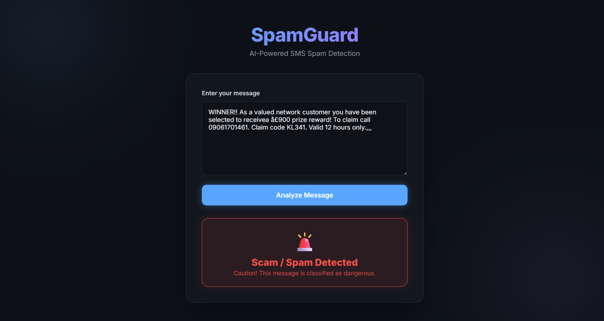

# SMS Spam Classifier 🚨

A modern, AI-powered web application that classifies SMS messages as **Spam** or **Ham** (Safe) with high precision using Machine Learning.

 

## 🚀 Features
- **Real-time Prediction**: Instantly analyze messages for spam content.
- **Modern UI**: Sleek, responsive design with glassmorphism and dark mode.
- **ML Powered**: Uses a Multinomial Naive Bayes model trained on TF-IDF features and text length.
- **Robust Preprocessing**: Full NLP pipeline including tokenization, stop word removal, and stemming.

## 🛠️ Technologies
- **Backend**: [FastAPI](https://fastapi.tiangolo.com/), [Uvicorn](https://www.uvicorn.org/), [Gunicorn](https://gunicorn.org/)
- **Machine Learning**: [Scikit-learn](https://scikit-learn.org/), [NLTK](https://www.nltk.org/), [NumPy](https://numpy.org/), [SciPy](https://scipy.org/)
- **Frontend**: HTML5, Vanilla CSS, JavaScript (ES6+)
- **Deployment**: [Render](https://render.com/) / [GitHub](https://github.com/)

## 📦 Installation & Local Setup

1. **Clone the repository**:
   ```bash
   git clone https://github.com/YOUR_USERNAME/sms-spam-classifier.git
   cd sms-spam-classifier
   ```

2. **Create a virtual environment**:
   ```bash
   python -m venv venv
   source venv/bin/activate  # On Windows: venv\Scripts\activate
   ```

3. **Install dependencies**:
   ```bash
   pip install -r requirements.txt
   ```

4. **Run the application**:
   ```bash
   python main.py
   ```
   The app will be available at `http://127.0.0.1:8000`.

## 🌐 Deployment

This project is configured for easy deployment on **Render**:

1. Push your code to GitHub.
2. Link your GitHub repo to a new **Web Service** on Render.
3. **Build Command**: `pip install -r requirements.txt`
4. **Start Command**: `gunicorn -w 4 -k uvicorn.workers.UvicornWorker main:app`

## 📊 Model Details
The classifier uses a **Multinomial Naive Bayes** algorithm. It was trained on the SMS Spam Collection dataset, achieving excellent accuracy by combining:
1. **TF-IDF Vectorization** (3000 features).
2. **Text Length Scaling**: Normalized character count to improve classification of short vs. long messages.

## 🤝 Contributing
Contributions are welcome! Feel free to open an issue or submit a pull request.

## 📄 License
This project is open-source and available under the [MIT License](LICENSE).
